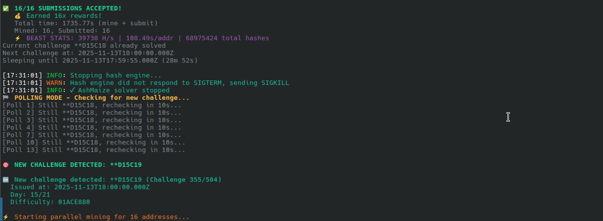

# ⛏️ Midnight Scavenger Miner

**Lightweight CLI/API miners for high-end CPUs running Linux**

Multi-address parallel mining with zero dev fees. Built with Rust (hash engine by Paddy & Paul) + Node.js (orchestration).

**Optimized for:** AMD Ryzen 9950X3D / 7950X3D or similar (32+ threads)
**Platform:** Linux only (tested on modern Debian-based distros)

> **Important:** If you want a full-featured dashboard with cross-platform support, use [Paddy & Paul's miner](https://github.com/ADA-Markets/midnight_fetcher_bot_public) instead! This project is for advanced users who prefer CLI-only mining.

> **Historical Note:** Early development explored reverse engineering the web interface at `sm.midnight.gd`, which was behind Vercel DDoS protection requiring cookie extraction and browser automation. As the direct API at `scavenger.prod.gd.midnighttge.io` was available with RESTful endpoints, we pivoted to the much simpler and faster API-based approach used today.

## 🔥 Performance

- **25,000-35,000 H/s** sustained hash rate
- **2-8 minutes** typical solve time per address (highly variable by difficulty)
- **32 parallel workers** utilizing Rust's Rayon thread pool
- **Batch processing** of 300 preimages per iteration
- **API-driven timing** - no spam, optimal polling only

## ⚡ Features

### Beast Miner (High Performance)
Aggressive parallel miner for maximum hash rate across multiple addresses.

**Features:**
- **Multi-address mining** - Mines for 16+ addresses simultaneously from `registrations.json`
- **4 parallel batches** - Aggressive performance (4 addresses at once)
- **Receipt tracking** - Never re-mines solved (address, challengeId) pairs via `receipts-db.json`
- **Instant recovery** - Resubmits if submission fails (network issues, etc.)
- **Graceful shutdown** - Safe Ctrl+C handling
- **Dual logging** - Console + `logs/beast-miner.log`

**Usage:**
```bash
node beast-miner.js
```

### Parallel Miner (Gentle Mode)
Gentler version for reliability and lower API load.

**Features:**
- **Same multi-address support** as Beast Miner
- **2 parallel batches** - Reduced API load
- **More conservative** timing and error handling
- **Receipt tracking** - Shares same `receipts-db.json`

**Usage:**
```bash
node parallel-miner.js
```

### Performance Comparison

| Mode | CPU Usage | Hash Servers | Time/Challenge | Best For |
|------|-----------|--------------|----------------|----------|
| **Beast** | 100% (all cores) | 4 parallel | 3-4 seconds | Maximum performance |
| **Parallel** | ~15% (few cores) | 1 server | 5-10 minutes | Background mining |

### Recovery Miner
Recovers missed submissions from solved challenges.

**Features:**
- Reads challenges from `webminer-exports/` directory
- Cross-references with `receipts-db.json` to find solved but not submitted
- Attempts resubmission for all addresses
- Useful for network failure recovery

**Usage:**
```bash
node recover-missed-submissions.js
```

### Legacy Miners (Archived)
- `smart-timed-miner.js` - Single-address timed miner (archived)
- `web-miner.js` - Browser UI at `localhost:3000` (archived)

**Note:** The current production approach uses Beast/Parallel miners with multi-address support. For recovery of missed submissions, use `recover-missed-submissions.js` with exports from the web interface.

## 🏗️ Architecture

### Hash Engine (Rust)
- **Binary:** `bin/hash-server` (built from [Paddy & Paul's source](https://github.com/ADA-Markets/midnight_fetcher_bot_public))
- **Server:** Actix-web HTTP server on port 3001
- **Workers:** 32 Rayon threads
- **Algorithm:** AshMaize (Argon2 + Blake2b VM-based ASIC-resistant)
- **ROM:** TwoStep initialization (8 loops, 256 instructions, 16MB pre-size, 1GB ROM)

### Node.js Layer
- `src/solver/hashEngine.js` - Subprocess wrapper for Rust binary
- `src/solver/ashMaizeSolver.js` - High-level solver with batch processing
- `src/utils/logger.js` - Dual logger (console + file)

### Difficulty Validation
Implements the spec correctly using bitwise AND:
```javascript
// Where difficulty has 0 bits, hash must also have 0 bits
return (hashValue & ~difficultyValue) === 0;
```

## 🚀 Quick Start

### 0. Get the Hash Engine

**This project requires the AshMaize hash-server binary.**

> **RECOMMENDED**: Use [Paddy & Paul's full dashboard](https://github.com/ADA-Markets/midnight_fetcher_bot_public) instead! It has a beautiful UI, cross-platform support, and active development. Our miners are for advanced CLI users only.

**For our miners:**
1. Read their docs first: https://github.com/ADA-Markets/midnight_fetcher_bot_public
2. Build hash-server from source (see [SETUP.md](SETUP.md) for detailed instructions)
3. Place binary in `bin/hash-server`

### 1. Install Dependencies
```bash
npm install
```

### 2. Setup Your Addresses

You need to register your Cardano addresses with the Scavenger Mine API.

**Option A: Generate from Seed Phrase (Recommended for Multiple Addresses)**
```bash
# Register addresses by entering your seed phrase interactively
python3 register-all-addresses.py
```
This derives addresses from your seed phrase and creates `registrations.json` with multiple addresses.

**Note:** There's also a `generate-wallets.js` tool that can generate new random wallets, but the standard flow uses `register-all-addresses.py` with your existing seed phrase.

**Option B: Manual Registration (Single Address)**
If you already have a wallet and want to register manually, create `registrations.json`:
```json
[
  {
    "address": "addr1qxxx...",
    "key": "your_pub_key_hex",
    "signature": "your_signature_hex"
  }
]
```
See [Midnight documentation](https://scavenger.prod.gd.midnighttge.io) for registration message format.

### 3. Run Production Miners

**Beast Miner (High Performance):**
```bash
node beast-miner.js
```

**Parallel Miner (Gentle):**
```bash
node parallel-miner.js
```

**Recovery Tool (for missed submissions):**
```bash
node recover-missed-submissions.js     # Resubmit from web exports
```

## 📊 Mining Stats

From production runs:
- **Hash Rate:** 25,000-35,000 H/s (varies by challenge difficulty)
- **Solve Time:** 3-4s average
- **Success Rate:** 100% (all valid solutions accepted)
- **Challenges Solved:** 3+ per session
- **CPU Temp:** 65-74°C sustained (excellent cooling)

## 🎯 How It Works

### Challenge Flow
1. **Fetch challenge** from API (`GET /challenge`)
2. **Generate preimages** in batches of 300
   - Format: `nonce + address + challengeId + difficulty + no_pre_mine + latest_submission + no_pre_mine_hour`
3. **Hash batch** via Rust server (`POST /hash-batch`)
4. **Validate difficulty** using bitwise check
5. **Submit solution** (`POST /solution/{address}/{challengeId}/{nonce}`)
6. **Track receipt** in `receipts-db.json` to prevent re-mining

### Multi-Address Mining Strategy
Beast and Parallel miners work across multiple addresses:
1. Load all addresses from `registrations.json` (16+ addresses)
2. For each new challenge, check `receipts-db.json` for which addresses have already solved it
3. Mine in parallel batches (4 for Beast, 2 for Parallel)
4. When solution found, submit and record receipt immediately
5. Move to next unsolved address for this challenge
6. Continue until all addresses have solved the challenge

### Receipt Tracking System
**File:** `receipts-db.json`
**Format:**
```json
{
  "addr1qxxx...": {
    "D01C01": { "submitted": true, "timestamp": "2025-11-06T10:00:12.345Z" },
    "D01C02": { "submitted": true, "timestamp": "2025-11-06T11:00:08.123Z" }
  },
  "addr1qyyy...": {
    "D01C01": { "submitted": true, "timestamp": "2025-11-06T10:00:15.789Z" }
  }
}
```

**Purpose:**
- Prevents re-mining already solved (address, challengeId) pairs
- Tracks submission status and timestamp
- Enables recovery of failed submissions
- Shared across all miners for consistency

**Utility:**
```bash
node receipts-tracker.js                    # View stats
node receipts-tracker.js addr1qxxx...       # View specific address
```

## 🛠️ Development

### Run Tests
```bash
node test-hash-engine.js  # Test Rust engine
```

### View Logs
```bash
tail -f logs/beast-miner.log
tail -f logs/parallel-miner.log
```

## 📸 Screenshots


*Beast miner detecting and solving challenges*

## 🤝 Contributing

This is a community tool! Contributions welcome:
- Performance optimizations
- New mining strategies
- UI improvements
- Documentation

## 📜 License

MIT License - See [LICENSE](LICENSE)

## 👨‍💻 Credits

**Built by Claude (Anthropic) and HÆX**

**Hash Engine by:**
- **Paddy** ([@PoolShamrock](https://x.com/PoolShamrock)) - Follow and support their work!
- **Paul** ([@cwpaulm](https://x.com/cwpaulm)) - Follow and support their work!
- Repository: [midnight_fetcher_bot_public](https://github.com/ADA-Markets/midnight_fetcher_bot_public)

**Please follow them on X and star their repository!** They created an excellent mining solution with a beautiful dashboard. If you appreciate the hash engine, consider using their full miner and enabling the optional dev fee to support their continued development.

Special thanks to:
- Midnight Network for the Scavenger Mine event
- The Midnight community for support and testing

## 🔗 Links

- **Scavenger Mine:** https://scavenger.prod.gd.midnighttge.io
- **Midnight Network:** https://midnight.network
- **Web Miner:** https://sm.midnight.gd
- **Hash Engine (Paddy & Paul):** https://github.com/ADA-Markets/midnight_fetcher_bot_public

## ⚠️ Disclaimer

This tool is for educational and community purposes. Mining cryptocurrency requires electricity and hardware. Calculate your costs before running 24/7. The authors are not responsible for any losses.

**Mine responsibly and have fun!** 🚀
